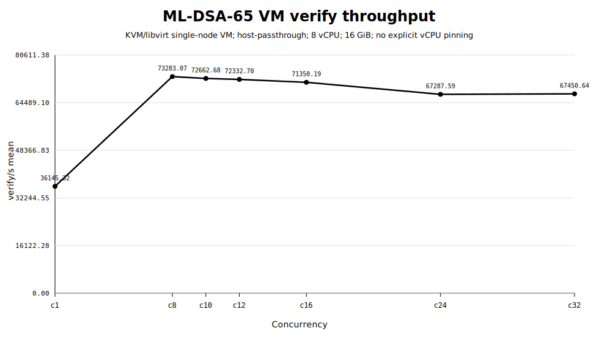
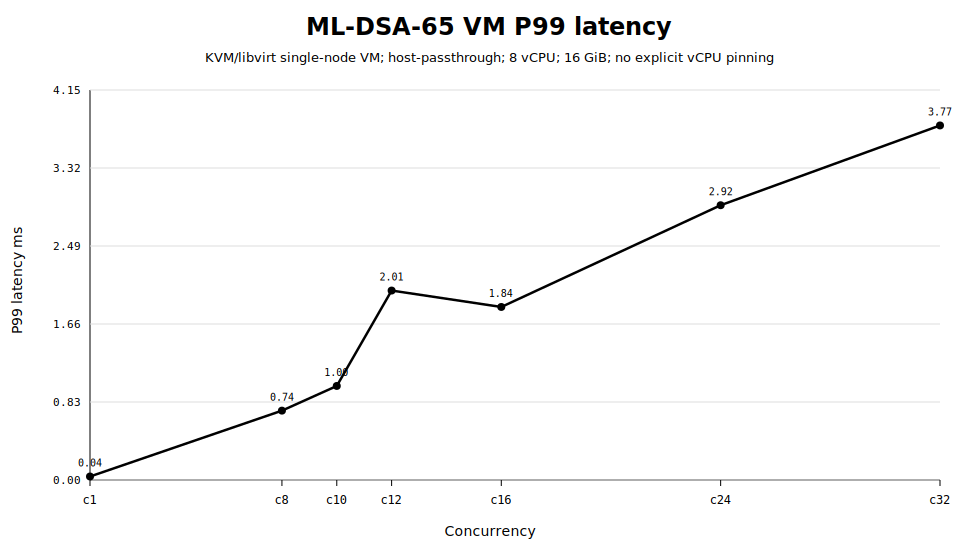
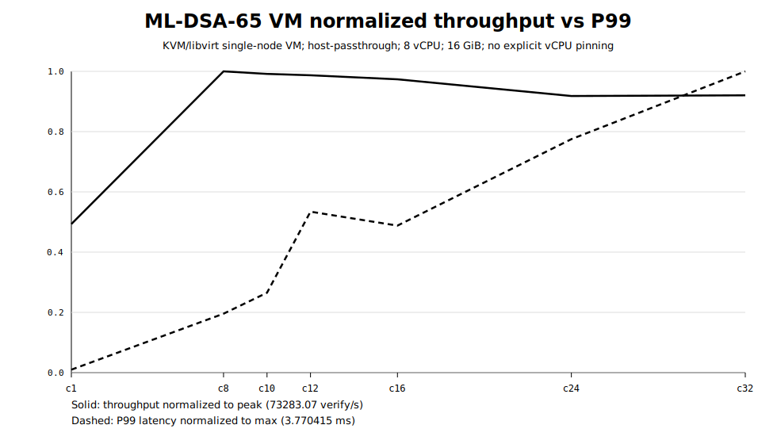

# ML-DSA-65 single-node VM baseline

- Run ID: `single-vm-mldsa-verify-20260601_022931`
- Run directory: `/home/rebel/pqc-runs/single-vm-mldsa-verify-20260601_022931`
- Topology: KVM/libvirt single-node VM
- VM: `pqc-fedora-vm-baseline`, 8 vCPU, 16 GiB RAM
- CPU mode: host-passthrough
- Explicit vCPU pinning: no
- LOADGEN VM used: no

## Summary table

| c | resolved | verify/s mean | stdev | p50 ms | p95 ms | p99 ms | max ms | errors | in-flight | truncated |
|---:|---|---:|---:|---:|---:|---:|---:|---:|---:|:---:|
| 1 | ML-DSA-65 | 36145.32 | 31.34 | 0.026370 | 0.034184 | 0.037267 | 0.552655 | 0 | 1 | False |
| 8 | ML-DSA-65 | 73283.07 | 117.28 | 0.037530 | 0.377037 | 0.737662 | 6.283345 | 0 | 8 | False |
| 10 | ML-DSA-65 | 72662.68 | 127.65 | 0.037667 | 0.530285 | 1.000120 | 4.657871 | 0 | 10 | False |
| 12 | ML-DSA-65 | 72332.70 | 221.22 | 0.037774 | 0.797906 | 2.014619 | 11.727169 | 0 | 12 | False |
| 16 | ML-DSA-65 | 71350.19 | 532.53 | 0.037877 | 1.089376 | 1.840085 | 7.209874 | 0 | 16 | False |
| 24 | ML-DSA-65 | 67287.59 | 535.98 | 0.039793 | 1.531526 | 2.922103 | 13.307937 | 0 | 24 | False |
| 32 | ML-DSA-65 | 67450.64 | 201.37 | 0.039044 | 2.107687 | 3.770415 | 16.827958 | 0 | 32 | False |

## Peak

- Best throughput: c8 = 73283.07 verify/s
- P99 at best throughput: 0.737662 ms

## Figures

## Monitoring note

The monitoring summary is generated after the run from benchmark JSON outputs. It is not live per-second CPU/memory telemetry.

## Diagnostics

See `environment/vm_diagnostics.md` and `manifest/run_manifest.json`.
