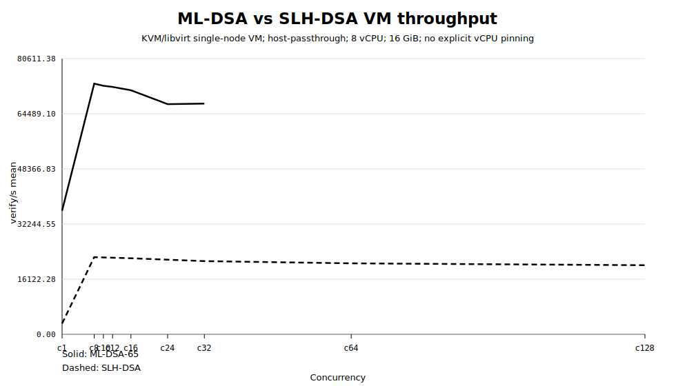
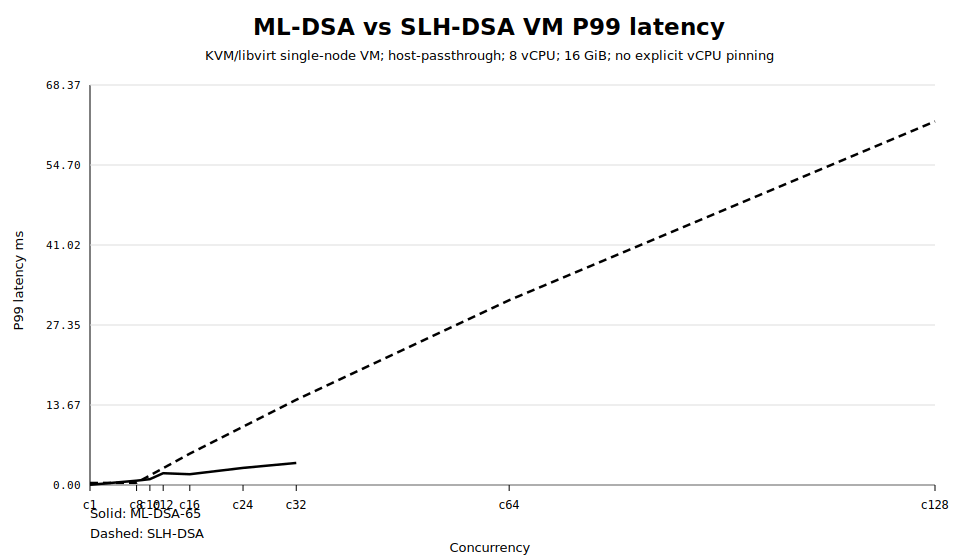
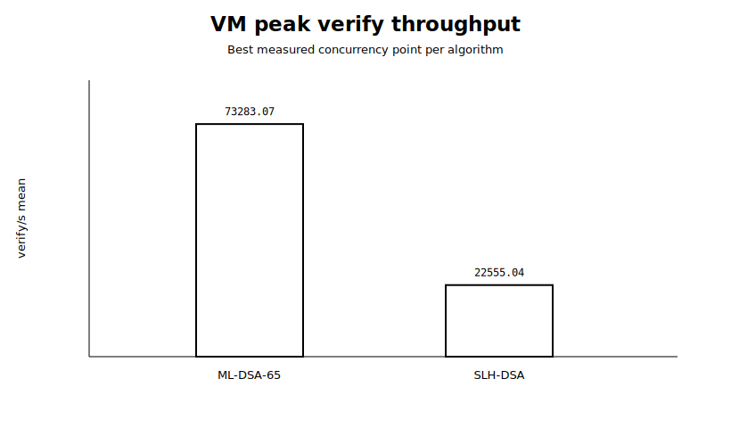

# ML-DSA vs SLH-DSA Verify-Capacity Single-VM Comparison — 2026-06-01

This report compares two single-node VM verify-capacity baselines:

- ML-DSA-65
- SLH-DSA / SPHINCS+-SHA2-128f-simple

## Scope

- Topology: single-node VM local benchmark
- VM: `pqc-fedora-vm-baseline`
- Hypervisor: KVM/libvirt
- CPU mode: `host-passthrough`
- vCPU: 8
- Memory: 16 GiB
- Explicit vCPU pinning: no
- LOADGEN VM used: no

## Peak results

- ML-DSA-65 peak: c8 = 73283.07 verify/s, P99 0.737662 ms
- SLH-DSA peak: c8 = 22555.04 verify/s, P99 0.390665 ms
- Peak-to-peak throughput ratio: ML-DSA delivered 3.25x SLH-DSA throughput

## Common concurrency points

| c | ML-DSA verify/s | SLH-DSA verify/s | ML/SLH throughput | ML-DSA P99 ms | SLH-DSA P99 ms | SLH/ML P99 |
|---:|---:|---:|---:|---:|---:|---:|
| 1 | 36145.32 | 3151.06 | 11.47x | 0.037267 | 0.340257 | 9.13x |
| 8 | 73283.07 | 22555.04 | 3.25x | 0.737662 | 0.390665 | 0.53x |
| 16 | 71350.19 | 22232.14 | 3.21x | 1.840085 | 5.362318 | 2.91x |
| 32 | 67450.64 | 21398.54 | 3.15x | 3.770415 | 14.568641 | 3.86x |

## Interpretation

Both algorithms reached their best measured VM throughput at c8 in this default KVM/libvirt configuration.

ML-DSA delivered higher peak throughput. SLH-DSA had lower P99 latency at c8 in this VM run, but its P99 latency increased sharply after c8. This indicates that additional concurrency beyond the practical knee mainly introduced queueing rather than additional useful capacity.

## Figures

