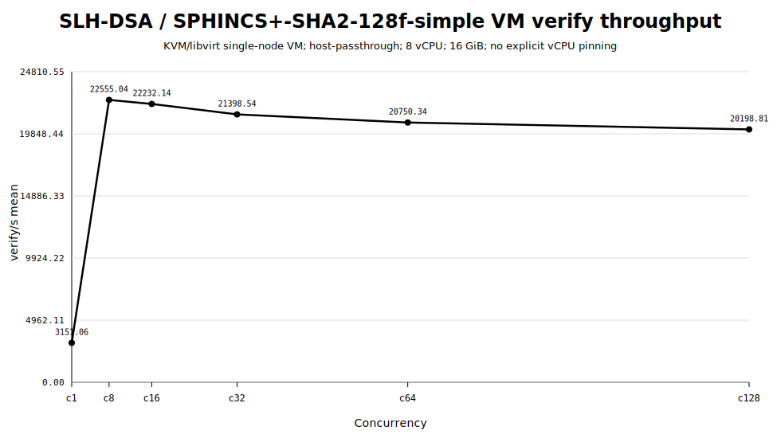
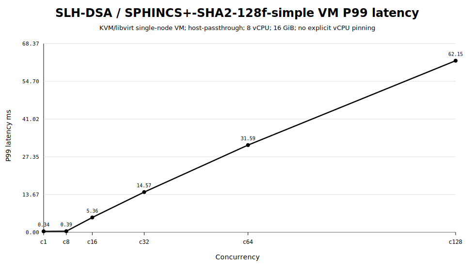
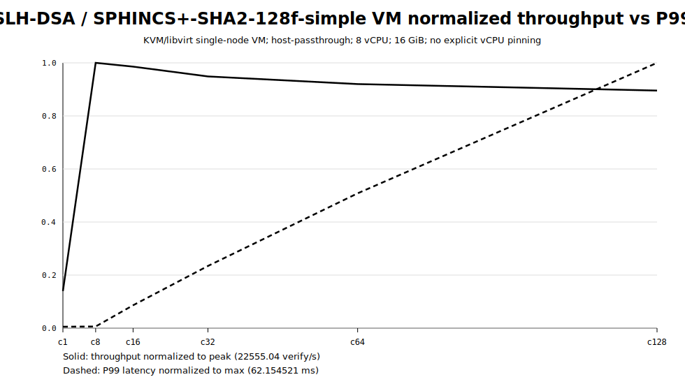

# SLH-DSA / SPHINCS+-SHA2-128f-simple single-node VM baseline

- Run ID: `single-vm-slhdsa-verify-20260601_025239`
- Run directory: `/home/rebel/pqc-runs/single-vm-slhdsa-verify-20260601_025239`
- Topology: KVM/libvirt single-node VM
- VM: `pqc-fedora-vm-baseline`, 8 vCPU, 16 GiB RAM
- CPU mode: host-passthrough
- Explicit vCPU pinning: no
- LOADGEN VM used: no

## Summary table

| c | resolved | verify/s mean | stdev | p50 ms | p95 ms | p99 ms | max ms | errors | in-flight | truncated |
|---:|---|---:|---:|---:|---:|---:|---:|---:|---:|:---:|
| 1 | SPHINCS+-SHA2-128f-simple | 3151.06 | 0.55 | 0.314547 | 0.333740 | 0.340257 | 0.822137 | 0 | 1 | False |
| 8 | SPHINCS+-SHA2-128f-simple | 22555.04 | 50.62 | 0.351480 | 0.375626 | 0.390665 | 3.585081 | 0 | 8 | False |
| 16 | SPHINCS+-SHA2-128f-simple | 22232.14 | 15.63 | 0.354153 | 3.365632 | 5.362318 | 25.231877 | 0 | 16 | False |
| 32 | SPHINCS+-SHA2-128f-simple | 21398.54 | 33.01 | 0.358530 | 7.912946 | 14.568641 | 49.867612 | 0 | 32 | False |
| 64 | SPHINCS+-SHA2-128f-simple | 20750.34 | 32.42 | 0.361540 | 16.996856 | 31.588178 | 112.207515 | 0 | 64 | False |
| 128 | SPHINCS+-SHA2-128f-simple | 20198.81 | 26.65 | 0.365653 | 33.709618 | 62.154521 | 246.023593 | 0 | 128 | False |

## Peak

- Best throughput: c8 = 22555.04 verify/s
- P99 at best throughput: 0.390665 ms

## Figures

## Monitoring note

The monitoring summary is generated after the run from benchmark JSON outputs. It is not live per-second CPU/memory telemetry.

## Diagnostics

See `environment/vm_diagnostics.md` and `manifest/run_manifest.json`.
